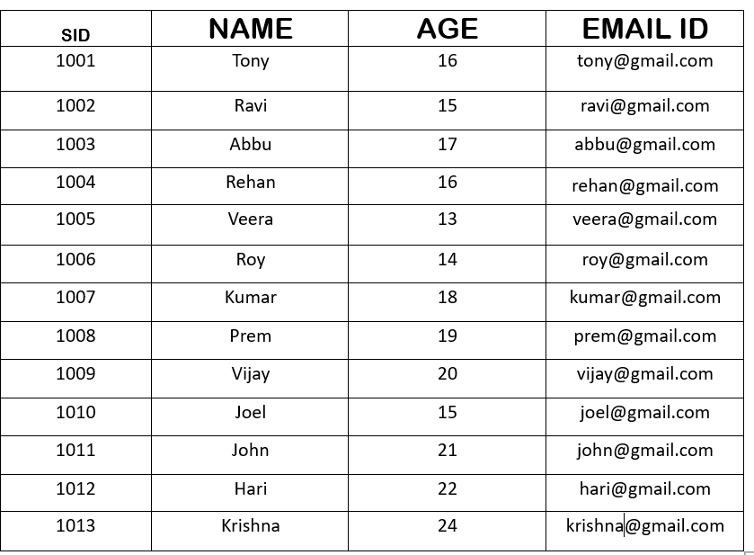
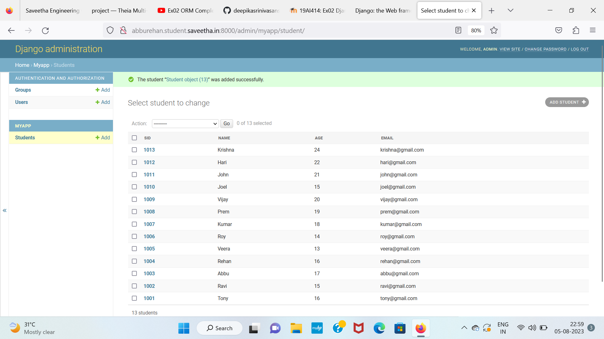

# Django ORM Web Application

## AIM
To develop a Django application to store and retrieve data from a database using Object Relational Mapping(ORM).

## Entity Relationship Diagram




## DESIGN STEPS

### STEP 1:
Clone the problem from github

### STEP 2:
Create a new app

### STEP 3:
Enter the code for admin.py and model.py

### STEP 4:
Excute Django admin and create 10 students

## PROGRAM :

```

Models.py

from django.db import models
from django.contrib import admin
class Student (models.Model):
    sid=models.CharField(max_length=20,help_text="Employee ID")
    name=models.CharField(max_length=100)
    age=models.IntegerField()
    email=models.EmailField()

class StudentAdmin(admin.ModelAdmin):
    list_display=('sid','name','age','email')

Admin.py

from django.contrib import admin
from .models import Student,StudentAdmin
admin.site.register(Student,StudentAdmin)

```


## OUTPUT



## RESULT

Program excuted successfully